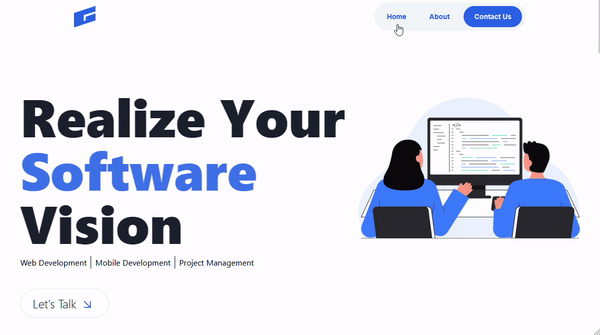

## Steps to run this project locally

1. Clone the repository:

    ```bash
    git clone https://github.com/Jgarette0/LaVue.git
    ```

2. Navigate to the project directory:

    ```bash
    cd lavue
    ```

3. Install PHP dependencies:

    ```bash
    composer install
    ```

4. Install Node.js dependencies:

    ```bash
    npm install
    ```

5. Copy the example environment file and configure it:

    ```bash
    cp .env.example .env
    ```

6. Generate an application key:

    ```bash
    php artisan key:generate
    ```

7. Compile the assets:

    ```bash
    npm run dev
    ```

8. Serve the application:

    ```bash
    php artisan serve
    ```

<<<<<<< HEAD

=======
<div style="text-align: center;">
  
</div>
>>>>>>> c040913fe0e45369f046ac1012bf66d5d257920c
